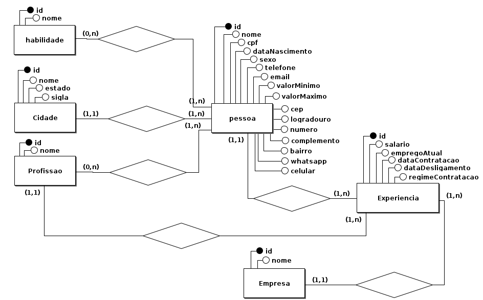
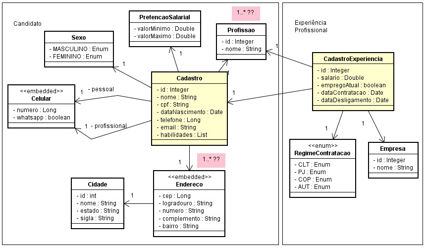

# Digytal - Solução de Currículo Vitae
*Este é um projeto desenvolvido na MJV School Java como proposta de projeto.*

Este é um projeto desenvolvido pela empresa Digytal no ano de 1950, uma época em que a tecnologia ainda era considerada futurista. Nesse período, linguagens de programação começaram a surgir no mercado, possibilitando a automação de processos por meio da computação. No entanto, bancos de dados relacionais ainda não eram tão comuns. Foi nesse contexto "limitado" que a Digytal recebeu sua primeira demanda como uma fábrica de software: desenvolver uma solução que permitisse às pessoas elaborar seus currículos vitae para serem enviados via e-mail e armazenados em um banco de dados centralizado da People Job, uma das maiores empresas de recrutamento e seleção de profissionais de TI.

## Escopo do Projeto

O escopo inicial do projeto consiste na criação de um programa simples, no qual os candidatos possam preencher seus dados pessoais, endereço, informações de contato, experiência profissional e pretensão salarial por meio do console. Esses registros devem ser coletados pelo sistema e gerar dois arquivos de saída com layouts delimitado e posicional, respectivamente, seguindo as especificações abaixo:

### Dados Pessoais:
- Nome
- CPF
- Data de Nascimento
- Sexo

### Dados de Endereço:
- Logradouro
- Número
- Complemento
- Bairro
- Cidade
- Estado

### Dados de Contato:
- E-mail
- Telefone
- Celular
- Se o celular for WhatsApp

### Dados Profissionais:
- Profissão
- Empresa
- Salário
- Emprego Atual

### Habilidades:
- Lista de habilidades

### Pretensão Salarial:
- Valor Mínimo
- Valor Máximo

### Modelo entidade relacionamento (MER):


### Mapeamento Objeto Relacional (ORM):


### Endpoints da API

- `GET /api/produtos`: Retorna a lista de produtos disponíveis.
- `POST /api/produtos`: Cria um novo produto.
- `GET /api/produtos/{id}`: Retorna os detalhes de um produto específico.
- `PUT /api/produtos/{id}`: Atualiza os detalhes de um produto existente.
- `DELETE /api/produtos/{id}`: Remove um produto do sistema.


### Exemplo - GET /api/produtos/1

**Requisição:**

**Resposta:**
```json
{
  "id": 1,
  "nome": "Produto A",
  "preco": 99.99,
  "descricao": "Descrição do Produto A"
}
